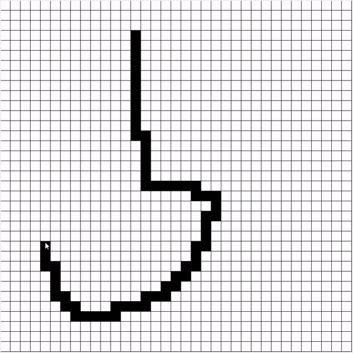

# dijkstraTkinter
python tkinter visualization of Dijkstra's algorithm

## How to Use
Start either using IDLE F5 or just:
```
python main.py
```

* Double left click to mark start
* Single left click to draw obstacles
* Single click an obstacle to remove
* Double right click to mark end

The algorithm starts immediately after an *end* block is selected

## Example

